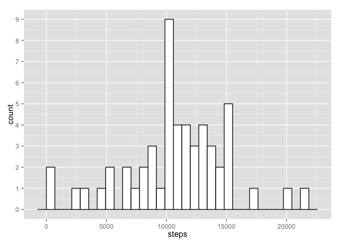
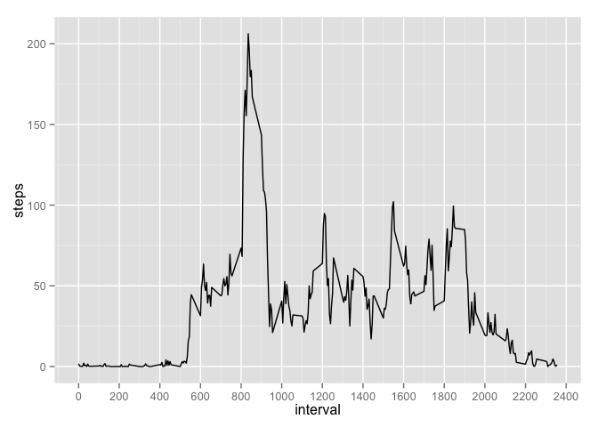
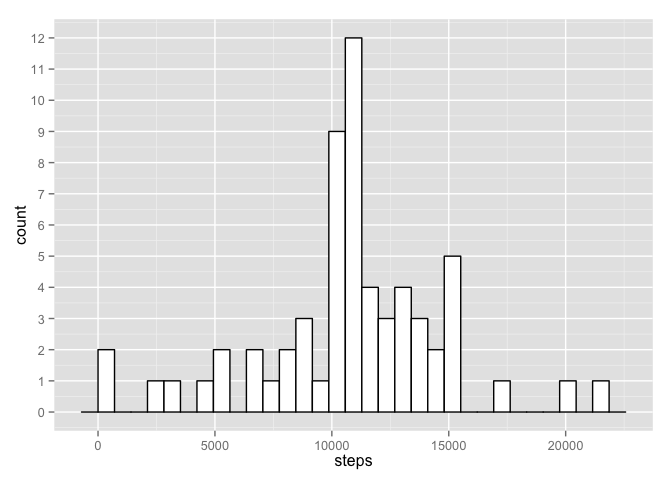
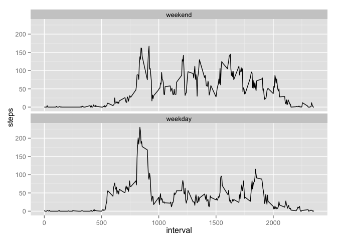

# Reproducible Research: Peer Assessment 1


## Loading and preprocessing the data

The following code shows the loading of the data:

```r
# unzip compressed data
unzip("activity.zip")

# read values
df <- read.csv("activity.csv", header=TRUE)
```
No other processing/transformation of the data into a format suitable for your analysis is necessary.


## What is mean total number of steps taken per day?

For this part of the assignment, we have been instructed to ignore the missing values in the dataset.

Below is a histogram of the total number of steps taken each day:

```r
# load ggplot2 libary
library(ggplot2)

# Ignoring missing values in the dataset
df.filtered <- na.omit(df)

# Getting the sum of steps by date
stepsPerDay <- aggregate(df.filtered$steps, by=list(df.filtered$date), FUN=sum)
colnames(stepsPerDay) <- c("date","steps")

# Plot graph
ggplot(stepsPerDay, aes(x=steps)) +
  scale_y_continuous(breaks=seq(0,10)) +
  geom_histogram(color="black", fill="white")
```

 

Below is the calculation and report of the **mean** and **median** total number of steps taken per day:

```r
mean(stepsPerDay$steps)
```

```
## [1] 10766.19
```

```r
median(stepsPerDay$steps)
```

```
## [1] 10765
```

## What is the average daily activity pattern?

The following code will generate a time series plot of the 5-minute interval (x-axis) and the average number of steps taken, averaged across all days (y-axis):

```r
stepsPerInterval <- aggregate(df.filtered$steps, by=list(df.filtered$interval), FUN=mean)
colnames(stepsPerInterval) <- c("interval","steps")

ggplot(stepsPerInterval, aes(interval,steps)) +
  scale_x_continuous(breaks=seq(0,2400,by=200)) +
  geom_line()
```

 

Below will show that the 5-minute interval, on average across all the days in the dataset, contains the maximum number of steps starts at 835 (or 8:35 AM).

```r
head(stepsPerInterval[order(-stepsPerInterval$steps),],1)
```

```
##     interval    steps
## 104      835 206.1698
```

## Imputing missing values

Note that there are a number of days/intervals where there are missing values (coded as `NA`). The presence of missing days may introduce
bias into some calculations or summaries of the data.

Below is the calculation and report of the total number of missing values in the dataset (i.e. the total number of rows with `NA`s)

```r
nrow(subset(df, is.na(df$steps)))
```

```
## [1] 2304
```

We need to devise a strategy for filling in all of the missing values in the dataset. Since we already calculated the average steps that were taken per interval in the last exercise, we can reuse those values as a method of imputing the values of columns with NA for those corresponding intervals.

```r
# Make a copy of the original data frame
df.imputed <- df

# If the # of steps are missing, replace it with the average value we calculated
# for that specific 5-minute interval with the data that does exist
df.imputed$steps[is.na(df.imputed$steps)] <- round(stepsPerInterval[stepsPerInterval$interval %in% df.imputed$interval,]$steps)
```

The following is a regeneration of the histogram of the total number of steps taken each day and Calculate and report the **mean** and **median** total number of steps taken per day that we original calculated after omitting missing data values.

```r
# Getting the sum of steps by date
stepsPerDayImputed <- aggregate(df.imputed$steps, by=list(df.imputed$date), FUN=sum)
colnames(stepsPerDayImputed) <- c("date","steps")

# Plot graph
ggplot(stepsPerDayImputed, aes(x=steps)) +
  scale_y_continuous(breaks=seq(0,15)) +
  geom_histogram(color="black", fill="white")
```

 

```r
mean(stepsPerDayImputed$steps)
```

```
## [1] 10765.64
```

```r
median(stepsPerDayImputed$steps)
```

```
## [1] 10762
```
These values for the **mean** and **median** differ from the estimates from the first part of the assignment only slightly which would be expected because we are taking into considerations averages.

The histogram shows a very different graph with the values closer to the median being more represented by the imputing of average step values for the missing intervals. This is an explainable consequence since we are talking about summing up the total daily number of steps and the values would be greater now that we created values for data that was originally missing and omitted.


## Are there differences in activity patterns between weekdays and weekends?

We are using the dataset with the filled-in missing values for this part. We created a new factor variable in the dataset (daytype) with two levels -- "weekday" and "weekend" indicating whether a given date is a weekday or weekend day:

```r
# Add factor variable to data frame based on weekend or weekday
df.imputed$daytype <- as.factor(ifelse(weekdays(as.Date(df.imputed$date)) %in% c("Saturday","Sunday"), "weekend", "weekday"))
```

The following is a panel plot containing a time series plot (i.e. `type = "l"`) of the 5-minute interval (x-axis) and the average number of steps taken, averaged across all weekday days or weekend days (y-axis):

```r
# Getting the sum of steps by date
stepsPerDayType <- aggregate(df.imputed$steps, by=list(df.imputed$interval,df.imputed$daytype), FUN=mean)
colnames(stepsPerDayType) <- c("interval","daytype","steps")
stepsPerDayType$steps <- round(stepsPerDayType$steps)

# Ordering data by the day type
stepsPerDayType$daytype <- factor(stepsPerDayType$daytype, levels = c("weekend", "weekday"))

# Plot the data
ggplot(stepsPerDayType, aes(interval,steps)) + 
  facet_wrap(~daytype, nrow=2) +
  geom_line()
```

 

The most notable difference you will notice with the plots is that there is more activity in the morning during the weekdays.  On the weekends there is a smaller morning peak and noticable increases throughout the rest of the day.
